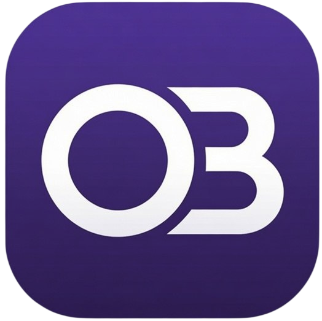
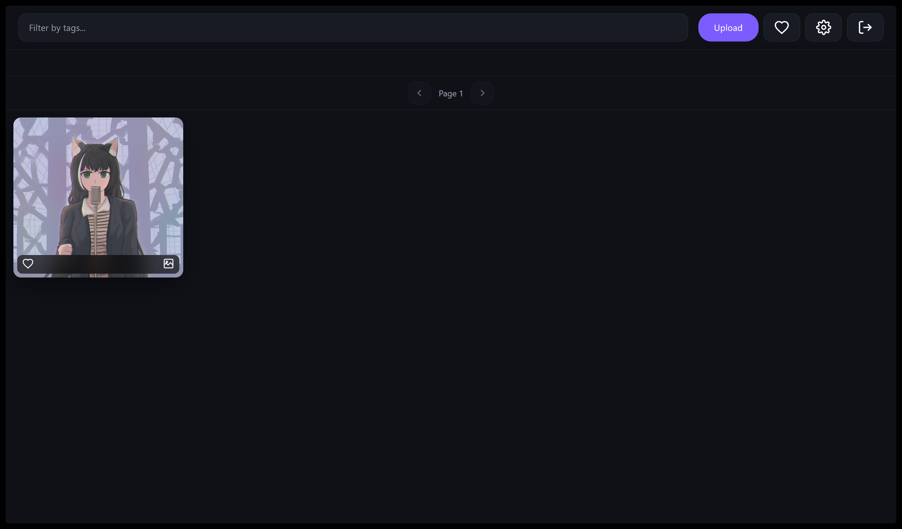
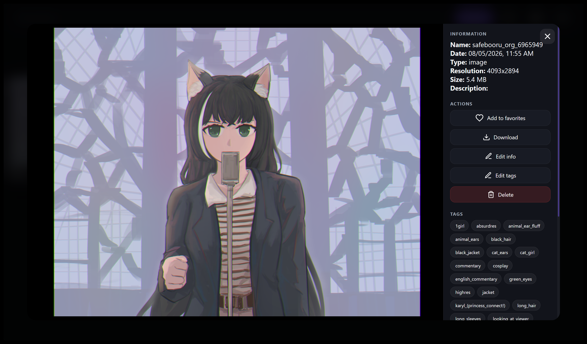
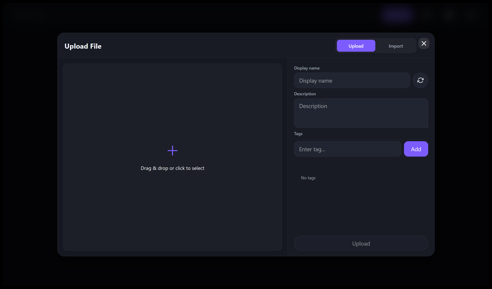
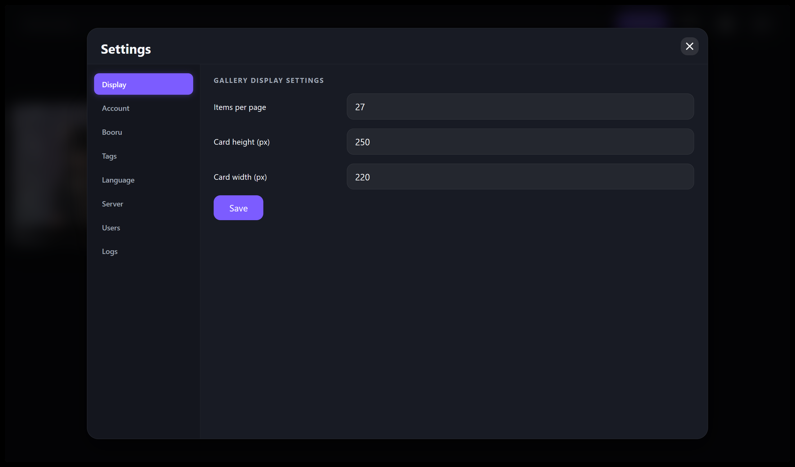
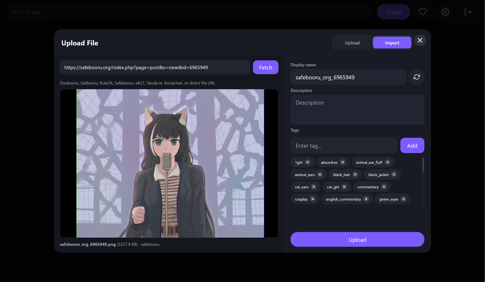
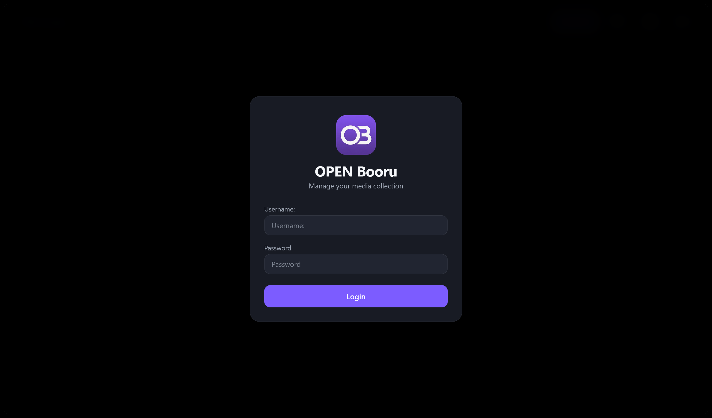

<p align="center">
  
</p>

# OPEN Booru

**Encrypted self-hosted personal media gallery** — images, videos, GIFs.  
Private. Local. Yours.

[English](#english) · [Русский](#русский)

---

<a id="english"></a>

## English

OPEN Booru is a lightweight, self-hosted media gallery designed for personal use.  
All media is encrypted **per user** with AES. You fully control your data — nothing leaves your server.

### Key Features

| Feature | Description |
|---------|-------------|
| **Per-user AES encryption** | Each user’s media is encrypted with their own key. Even the server admin cannot read other users’ files without the password. |
| **Tags & search** | Full tagging system with fast search and filtering. |
| **Favorites** | Mark and quickly access your favorite posts. |
| **Roles & multi-user** | Support for multiple users with different roles (owner / admin / user). |
| **Booru import** | One-click import from popular imageboards (see list below). |
| **Multilingual UI** | Interface available in 8 languages. |
| **Images + Video + GIF** | Native support for common image formats, animated GIFs and videos. |
| **Modern web UI** | Clean, responsive gallery, viewer, upload and settings pages. |
| **SQLite backend** | Zero external database dependency (uses `sql.js`). |
| **Lightweight** | Pure Node.js + Express. Easy to run on a VPS, home server or even a Raspberry Pi. |

### Supported Booru Import Sources

- Gelbooru
- Rule34
- Realbooru
- Xbooru
- Hypnohub
- TBIB
- Safebooru
- Derpibooru
- Furbooru
- Ponybooru
- Danbooru
- e621
- Yande.re
- Konachan

### Requirements

- **Node.js ≥ 18** (recommended ≥ 20)
- `git` and `curl` (for automatic install)
- ~50–100 MB disk space for the application itself (media storage is separate)

### Screenshots

<details>
<summary>Click to expand screenshots</summary>

| Gallery | Viewer | Upload |
|:---:|:---:|:---:|
|  |  |  |

| Settings | Import | Login |
|:---:|:---:|:---:|
|  |  |  |

</details>

### Installation

#### 1. Automatic (recommended)

**Linux** (Arch / Ubuntu / Debian / Fedora / derivatives):

```bash
curl -fsSL https://raw.githubusercontent.com/RegentsVoice/OPEN_Booru/main/scripts/install-linux.sh | bash
cd ~/OPEN_Booru && npm start
```

**Windows** (PowerShell):

```powershell
irm https://raw.githubusercontent.com/RegentsVoice/OPEN_Booru/main/scripts/install-windows.ps1 | iex
cd $HOME\OPEN_Booru; npm start
```

The installer will:
- Install Node.js if needed
- Clone the repository into `~/OPEN_Booru` (or `$HOME\OPEN_Booru`)
- Download the required `spark-md5.min.js`
- Run `npm install`

#### 2. Manual

```bash
git clone https://github.com/RegentsVoice/OPEN_Booru.git
cd OPEN_Booru
mkdir -p public/lib
curl -fsSL -o public/lib/spark-md5.min.js https://cdn.jsdelivr.net/npm/spark-md5@3.0.2/spark-md5.min.js
npm install
npm start
```

#### 3. Docker

```bash
# Make sure spark-md5.min.js exists in public/lib/ first
docker build -t open-booru -f - . <<'DF'
FROM node:20-bookworm-slim
WORKDIR /app
COPY package.json package-lock.json* ./
RUN npm install --omit=dev
COPY . .
EXPOSE 3001
CMD ["node", "server/index.js"]
DF

docker run -d --name open-booru -p 3001:3001 \
  -v open-booru-data:/app/database \
  -v open-booru-media:/app/media \
  -v open-booru-logs:/app/logs \
  -e PORT=3001 \
  open-booru
```

### Usage

After starting the server:

```
http://localhost:3001
```

1. Open the address in your browser.
2. Create the first account (it becomes admin).
3. Upload media or import from supported boorus.
4. Organize with tags and favorites.


### License

[MIT](https://github.com/RegentsVoice/OPEN_Booru/blob/main/LICENSE)

---

<a id="русский"></a>

## Русский

**OPEN Booru** — лёгкая self-hosted галерея для личного использования.  
Все медиа шифруются **отдельно для каждого пользователя** алгоритмом AES. Вы полностью контролируете свои данные.

### Основные возможности

| Возможность | Описание |
|-------------|----------|
| **Шифрование AES на пользователя** | Медиа каждого пользователя шифруется своим ключом. Даже администратор сервера не может прочитать чужие файлы без пароля. |
| **Теги и поиск** | Полноценная система тегов с быстрым поиском и фильтрацией. |
| **Избранное** | Отмечайте и быстро находите любимые посты. |
| **Роли и мультипользователь** | Поддержка нескольких пользователей с разными ролями ( owner / admin / user). |
| **Импорт с борд** | Импорт одним кликом с популярных имиджборд (список ниже). |
| **Многоязычный интерфейс** | UI на 8 языках. |
| **Изображения + Видео + GIF** | Поддержка обычных изображений, анимированных GIF и видео. |
| **Современный веб-интерфейс** | Чистая и адаптивная галерея, просмотрщик, загрузка и настройки. |
| **SQLite** | Без внешних баз данных (используется `sql.js`). |
| **Лёгкий вес** | Чистый Node.js + Express. Легко запускается на VPS, домашнем сервере или даже Raspberry Pi. |

### Поддерживаемые борды для импорта

- Gelbooru
- Rule34
- Realbooru
- Xbooru
- Hypnohub
- TBIB
- Safebooru
- Derpibooru
- Furbooru
- Ponybooru
- Danbooru
- e621
- Yande.re
- Konachan

### Требования

- **Node.js ≥ 18** (рекомендуется ≥ 20)
- `git` и `curl` (для автоматической установки)
- ~50–100 МБ места под само приложение (медиа хранится отдельно)

### Скриншоты

<details>
<summary>Нажмите, чтобы раскрыть</summary>

| Галерея | Просмотр | Загрузка |
|:---:|:---:|:---:|
|  |  |  |

| Настройки | Импорт | Вход |
|:---:|:---:|:---:|
|  |  |  |

</details>

### Установка

#### 1. Автоматическая (рекомендуется)

**Linux** (Arch / Ubuntu / Debian / Fedora и производные):

```bash
curl -fsSL https://raw.githubusercontent.com/RegentsVoice/OPEN_Booru/main/scripts/install-linux.sh | bash
cd ~/OPEN_Booru && npm start
```

**Windows** (PowerShell):

```powershell
irm https://raw.githubusercontent.com/RegentsVoice/OPEN_Booru/main/scripts/install-windows.ps1 | iex
cd $HOME\OPEN_Booru; npm start
```

Установщик:
- Установит Node.js при необходимости
- Склонирует репозиторий в `~/OPEN_Booru`
- Скачает `spark-md5.min.js`
- Выполнит `npm install`

#### 2. Ручная

```bash
git clone https://github.com/RegentsVoice/OPEN_Booru.git
cd OPEN_Booru
mkdir -p public/lib
curl -fsSL -o public/lib/spark-md5.min.js https://cdn.jsdelivr.net/npm/spark-md5@3.0.2/spark-md5.min.js
npm install
npm start
```

#### 3. Docker

```bash
# Сначала убедитесь, что spark-md5.min.js лежит в public/lib/
docker build -t open-booru -f - . <<'DF'
FROM node:20-bookworm-slim
WORKDIR /app
COPY package.json package-lock.json* ./
RUN npm install --omit=dev
COPY . .
EXPOSE 3001
CMD ["node", "server/index.js"]
DF

docker run -d --name open-booru -p 3001:3001 \
  -v open-booru-data:/app/database \
  -v open-booru-media:/app/media \
  -v open-booru-logs:/app/logs \
  -e PORT=3001 \
  open-booru
```

### Использование

После запуска сервера откройте в браузере:

```
http://localhost:3001
```

1. Создайте первый аккаунт (он станет администратором).
2. Загружайте медиа или импортируйте с поддерживаемых борд.
3. Организуйте контент с помощью тегов и избранного.


### Лицензия

[MIT](https://github.com/RegentsVoice/OPEN_Booru/blob/main/LICENSE)
