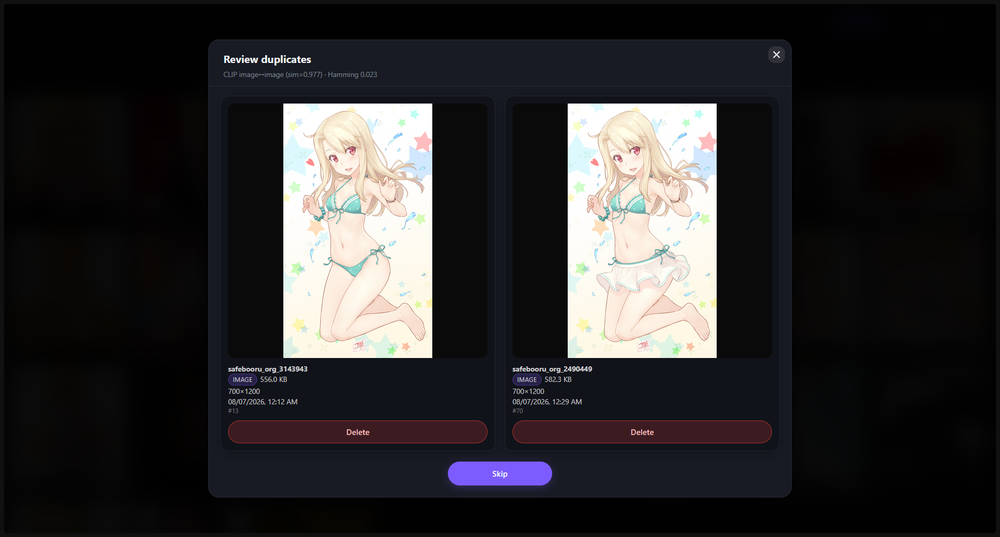

<p align="center">
  
</p>

# OPEN Booru

**Encrypted self-hosted personal media gallery** — images, videos, GIFs.  
Private. Local. Yours.

[English](#english) · [Русский](#русский)

---

<a id="english"></a>

## English

OPEN Booru is a lightweight, self-hosted media gallery designed for personal use.  
All media is encrypted **per user** with AES. You fully control your data — nothing leaves your server.

### Key Features

| Feature | Description |
|---------|-------------|
| **Per-user AES encryption** | Each user’s media is encrypted with their own key. Even the server admin cannot read other users’ files without the password. |
| **CLIP duplicates & search** | Local CLIP models for near-duplicate detection, semantic `search:` queries, and **Find similar** in the viewer. |
| **Tags & search** | Tag filters, exclude tags (`-tag`), and meta operators (`type:`, `sort:`, `fav:`, `search:`, `similar:`) in the search bar. |
| **Favorites** | Mark and quickly access your favorite posts. |
| **Roles & multi-user** | Support for multiple users with different roles (owner / admin / user). |
| **Booru import** | One-click import from popular imageboards (see list below). |
| **Export / import** | Full user data backup (encrypted databases + media) from Account settings. |
| **Multilingual UI** | Interface in English, Russian, and Simplified Chinese. |
| **Images + Video + GIF** | Native support for common image formats, animated GIFs and videos. |
| **Modern web UI** | Clean, responsive gallery, viewer, upload and settings. |

### CLIP (duplicates & semantic search)

Settings → **CLIP**:

| Tab | Purpose |
|-----|---------|
| **Detection** | Cosine similarity thresholds (same type / cross-type), workers, same-type-only. **Scan** rebuilds the pairs table. |
| **Search** | Min similarity for `search:` and for **Find similar**. |
| **Models** | Install, activate, or delete CLIP models (quantized and full). Models are stored under the project `models/` folder. |

**How it works**

- Embeddings are computed with a local CLIP vision model (`@xenova/transformers`). New uploads are embedded incrementally.
- Near-duplicate **pairs** are stored in a dedicated table after **Scan** and are not recomputed on every Review open.
- **Review** opens gallery of pairs.
- Requires **ffmpeg** for video/GIF frame sampling.

**Semantic search**

| Token | Effect |
|-------|--------|
| `search:red_car` | Rank gallery by CLIP text↔image similarity (underscore = space). |
| **Find similar** (viewer) | Adds `similar:<id>` and ranks by vision embedding closeness. |

### Search & meta filters

Type tags and operators in the search field.

| Token | Effect |
|-------|--------|
| `tag` | Posts that have this tag (AND if several) |
| `-tag` | Exclude posts with this tag |
| `type:image` / `type:img` | Images only |
| `type:video` | Videos only |
| `type:animation` | GIF / animations only (`type:gif` works while typing) |
| `fav:only` | Favorites only |
| `sort:newest` | Newest first (default) |
| `sort:oldest` | Oldest first |
| `sort:random` | Random order |
| `sort:duration_max` | Longest duration first |
| `sort:duration_min` | Shortest duration first |
| `search:…` | Semantic text search (CLIP) |
| `similar:ID` | Visually similar to media `ID` |

**UI tips**

- Selected tags: meta chips stay at the start of the list; exclude tags (`-tag`) stay at the end.
- Right-click a tag chip to toggle exclude ↔ include.
- Example: `type:video sort:duration_max -lowres`

### Supported Booru import sources

- Gelbooru, Rule34, Realbooru, Xbooru, Hypnohub, TBIB, Safebooru  
- Derpibooru, Furbooru, Ponybooru  
- Danbooru, e621, Yande.re, Konachan  

### Requirements

- **Node.js ≥ 18** (recommended ≥ 20)
- **ffmpeg** (video/GIF frames for CLIP embeddings)
- `git` and `curl` (for automatic install)
- ~50–100 MB for the app; CLIP models ~50–300 MB each under `models/` (media storage is separate)

### Screenshots

<details>
<summary>Click to expand screenshots</summary>

| Gallery | Viewer | Upload |
|:---:|:---:|:---:|
|  |  |  |

| Settings | Import | Login |
|:---:|:---:|:---:|
|  |  |  |

| CLIP review |
|:---:|
|  |

</details>

### Installation

#### 1. Automatic (recommended)

**Linux** (Arch / Ubuntu / Debian / Fedora / derivatives):

```bash
curl -fsSL https://raw.githubusercontent.com/RegentsVoice/OPEN_Booru/main/scripts/install-linux.sh | bash
cd ~/OPEN_Booru && npm start
```

**Windows** (PowerShell):

```powershell
irm https://raw.githubusercontent.com/RegentsVoice/OPEN_Booru/main/scripts/install-windows.ps1 | iex
cd $HOME\OPEN_Booru; npm start
```

The installer will:

- Install Node.js if needed  
- Install **ffmpeg** if missing  
- Clone the repository into `~/OPEN_Booru` (or `$HOME\OPEN_Booru`)  
- Download `spark-md5.min.js`  
- Run `npm install`  

#### 2. Manual

```bash
git clone https://github.com/RegentsVoice/OPEN_Booru.git
cd OPEN_Booru
mkdir -p public/lib
curl -fsSL -o public/lib/spark-md5.min.js https://cdn.jsdelivr.net/npm/spark-md5@3.0.2/spark-md5.min.js
npm install
npm start
```

Install **ffmpeg** on the host if you use CLIP features for video/GIF.

#### 3. Docker

```bash
# Make sure spark-md5.min.js exists in public/lib/ first
docker build -t open-booru -f - . <<'DF'
FROM node:20-bookworm-slim
RUN apt-get update && apt-get install -y --no-install-recommends ffmpeg \
  && rm -rf /var/lib/apt/lists/*
WORKDIR /app
COPY package.json package-lock.json* ./
RUN npm install --omit=dev
COPY . .
EXPOSE 3001
CMD ["node", "server/index.js"]
DF

docker run -d --name open-booru -p 3001:3001 \
  -v open-booru-data:/app/database \
  -v open-booru-media:/app/media \
  -v open-booru-models:/app/models \
  -v open-booru-logs:/app/logs \
  -e PORT=3001 \
  open-booru
```

### Usage

After starting the server:

```
http://localhost:3001
```

1. Create the first account (it becomes admin / owner).  
2. Upload media or import from supported boorus.  
3. Organize with tags, favorites, and meta filters.  


### License

[MIT](https://github.com/RegentsVoice/OPEN_Booru/blob/main/LICENSE)

---

<a id="русский"></a>

## Русский

**OPEN Booru** — лёгкая self-hosted галерея для личного использования.  
Все медиа шифруются **отдельно для каждого пользователя** алгоритмом AES. Вы полностью контролируете свои данные.

### Основные возможности

| Возможность | Описание |
|-------------|----------|
| **Шифрование AES на пользователя** | Медиа каждого пользователя шифруется своим ключом. Даже администратор сервера не может прочитать чужие файлы без пароля. |
| **CLIP: дубликаты и поиск** | Локальные CLIP-модели: поиск дубликатов, семантический `search:` и **Найти похожие** в просмотрщике. |
| **Теги и поиск** | Фильтры по тегам, исключение (`-tag`) и мета-операторы (`type:`, `sort:`, `fav:`, `search:`, `similar:`). |
| **Избранное** | Отмечайте и быстро находите любимые посты. |
| **Роли и мультипользователь** | Несколько пользователей с ролями owner / admin / user. |
| **Импорт с борд** | Импорт одним кликом с популярных имиджборд (список ниже). |
| **Экспорт / импорт** | Полный бэкап данных пользователя (зашифрованные БД + медиа) в настройках аккаунта. |
| **Многоязычный интерфейс** | UI: английский, русский, китайский (упрощённый). |
| **Изображения + Видео + GIF** | Обычные изображения, анимированные GIF и видео. |
| **Современный веб-интерфейс** | Адаптивная галерея, просмотрщик, загрузка и настройки. |

### CLIP (дубликаты и семантический поиск)

Настройки → **CLIP**:

| Вкладка | Назначение |
|---------|------------|
| **Детекция** | Пороги cosine (один тип / между типами), workers, только один тип. **Скан** пересобирает таблицу пар. |
| **Поиск** | Мин. схожесть для `search:` и для **Найти похожие**. |
| **Модели** | Установка, активация и удаление CLIP-моделей (квантованные и полные). Файлы лежат в `models/` проекта. |

**Как это работает**

- Эмбеддинги считает локальная CLIP vision-модель (`@xenova/transformers`). Новые загрузки обрабатываются сразу.
- Пары дубликатов пишутся в отдельную таблицу после **Скана** и не пересчитываются при каждом открытии **Просмотра**.
- **Просмотр** — галерея пар.
- Нужен **ffmpeg** для выборки кадров video/GIF.

**Семантический поиск**

| Токен | Действие |
|-------|----------|
| `search:красный_автомобиль` | Ранжирование по схожести текста и картинки (CLIP). Подчёркивание = пробел. |
| **Найти похожие** (вювер) | Добавляет `similar:<id>` и сортирует по близости vision-эмбеддингов. |

### Поиск и мета-фильтры

| Токен | Действие |
|-------|----------|
| `tag` | Посты с этим тегом (несколько — AND) |
| `-tag` | Исключить посты с этим тегом |
| `type:image` / `type:img` | Только изображения |
| `type:video` | Только видео |
| `type:animation` | Только GIF / анимации (`type:gif` доступен при наборе) |
| `fav:only` | Только избранное |
| `sort:newest` | Сначала новые (по умолчанию) |
| `sort:oldest` | Сначала старые |
| `sort:random` | Случайный порядок |
| `sort:duration_max` | Сначала самые длинные |
| `sort:duration_min` | Сначала самые короткие |
| `search:…` | Семантический текстовый поиск (CLIP) |
| `similar:ID` | Визуально похожие на медиа `ID` |

**Подсказки по UI**

- В выбранных тегах мета всегда в начале списка, исключённые (`-tag`) — в конце.
- ПКМ по таблетке тега — переключить exclude ↔ include.
- Пример: `type:video sort:duration_max -lowres`

### Поддерживаемые борды для импорта

- Gelbooru, Rule34, Realbooru, Xbooru, Hypnohub, TBIB, Safebooru  
- Derpibooru, Furbooru, Ponybooru  
- Danbooru, e621, Yande.re, Konachan  

### Требования

- **Node.js ≥ 18** (рекомендуется ≥ 20)
- **ffmpeg** (кадры video/GIF для CLIP)
- `git` и `curl` (для автоматической установки)
- ~50–100 МБ под приложение; модели CLIP ~50–300 МБ каждая в `models/` (медиа хранится отдельно)

### Скриншоты

<details>
<summary>Нажмите, чтобы раскрыть</summary>

| Галерея | Просмотр | Загрузка |
|:---:|:---:|:---:|
|  |  |  |

| Настройки | Импорт | Вход |
|:---:|:---:|:---:|
|  |  |  |

| Разбор CLIP |
|:---:|
|  |

</details>

### Установка

#### 1. Автоматическая (рекомендуется)

**Linux** (Arch / Ubuntu / Debian / Fedora и производные):

```bash
curl -fsSL https://raw.githubusercontent.com/RegentsVoice/OPEN_Booru/main/scripts/install-linux.sh | bash
cd ~/OPEN_Booru && npm start
```

**Windows** (PowerShell):

```powershell
irm https://raw.githubusercontent.com/RegentsVoice/OPEN_Booru/main/scripts/install-windows.ps1 | iex
cd $HOME\OPEN_Booru; npm start
```

Установщик:

- Установит Node.js при необходимости  
- Установит **ffmpeg**, если его нет  
- Склонирует репозиторий в `~/OPEN_Booru`  
- Скачает `spark-md5.min.js`  
- Выполнит `npm install`  

#### 2. Ручная

```bash
git clone https://github.com/RegentsVoice/OPEN_Booru.git
cd OPEN_Booru
mkdir -p public/lib
curl -fsSL -o public/lib/spark-md5.min.js https://cdn.jsdelivr.net/npm/spark-md5@3.0.2/spark-md5.min.js
npm install
npm start
```

Для CLIP по video/GIF установите на хост **ffmpeg**.

#### 3. Docker

```bash
# Сначала убедитесь, что spark-md5.min.js лежит в public/lib/
docker build -t open-booru -f - . <<'DF'
FROM node:20-bookworm-slim
RUN apt-get update && apt-get install -y --no-install-recommends ffmpeg \
  && rm -rf /var/lib/apt/lists/*
WORKDIR /app
COPY package.json package-lock.json* ./
RUN npm install --omit=dev
COPY . .
EXPOSE 3001
CMD ["node", "server/index.js"]
DF

docker run -d --name open-booru -p 3001:3001 \
  -v open-booru-data:/app/database \
  -v open-booru-media:/app/media \
  -v open-booru-models:/app/models \
  -v open-booru-logs:/app/logs \
  -e PORT=3001 \
  open-booru
```

### Использование

После запуска сервера откройте:

```
http://localhost:3001
```

1. Создайте первый аккаунт (он станет владельцем / администратором).  
2. Загружайте медиа или импортируйте с поддерживаемых борд.  
3. Организуйте контент тегами, избранному.

### Лицензия

[MIT](https://github.com/RegentsVoice/OPEN_Booru/blob/main/LICENSE)
